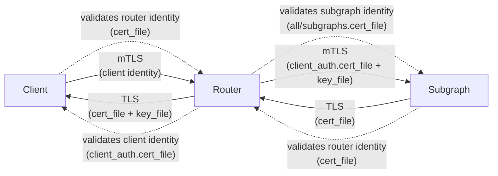

# Changelog

All notable changes to this project will be documented in this file.

The format is based on [Keep a Changelog](https://keepachangelog.com/en/1.0.0/),
and this project adheres to [Semantic Versioning](https://semver.org/spec/v2.0.0.html).

## [Unreleased]

## [6.0.0](https://github.com/graphql-hive/router/compare/hive-router-plan-executor-v5.0.0...hive-router-plan-executor-v6.0.0) - 2025-10-27

### <!-- 0 -->New Features

- *(router)* added support for label overrides with `@override` ([#518](https://github.com/graphql-hive/router/pull/518))

### <!-- 2 -->Refactoring

- *(error-handling)* add context to `PlanExecutionError` ([#513](https://github.com/graphql-hive/router/pull/513))

## [5.0.0](https://github.com/graphql-hive/router/compare/hive-router-plan-executor-v4.0.0...hive-router-plan-executor-v5.0.0) - 2025-10-23

### Added

- *(router)* support `hive` as source for supergraph ([#400](https://github.com/graphql-hive/router/pull/400))

### Fixed

- *(executor)* handle subgraph errors with extensions correctly ([#494](https://github.com/graphql-hive/router/pull/494))
- *(executor)* error logging in HTTP executor ([#498](https://github.com/graphql-hive/router/pull/498))
- *(ci)* fail when audit tests failing ([#495](https://github.com/graphql-hive/router/pull/495))
- *(executor)* project scalars with object values correctly ([#492](https://github.com/graphql-hive/router/pull/492))

### Other

- Add affectedPath to GraphQLErrorExtensions ([#510](https://github.com/graphql-hive/router/pull/510))
- Handle empty responses from subgraphs and failed entity calls ([#500](https://github.com/graphql-hive/router/pull/500))

## [4.0.0](https://github.com/graphql-hive/router/compare/hive-router-plan-executor-v3.0.0...hive-router-plan-executor-v4.0.0) - 2025-10-16

### Added

- *(router)* Subgraph endpoint overrides ([#488](https://github.com/graphql-hive/router/pull/488))
- *(router)* jwt auth ([#455](https://github.com/graphql-hive/router/pull/455))
- *(executor)* include subgraph name and code to the errors ([#477](https://github.com/graphql-hive/router/pull/477))
- *(executor)* normalize flatten errors for the final response ([#454](https://github.com/graphql-hive/router/pull/454))

### Fixed

- *(router)* allow null value for nullable scalar types while validating variables ([#483](https://github.com/graphql-hive/router/pull/483))
- *(router)* fix graphiql autocompletion, and avoid serializing nulls for optional extension fields ([#485](https://github.com/graphql-hive/router/pull/485))

## [3.0.0](https://github.com/graphql-hive/router/compare/hive-router-plan-executor-v2.0.0...hive-router-plan-executor-v3.0.0) - 2025-10-08

### Added

- *(router)* Advanced Header Management ([#438](https://github.com/graphql-hive/router/pull/438))

### Fixed

- *(executor)* ensure variables passed to subgraph requests ([#464](https://github.com/graphql-hive/router/pull/464))

## [2.0.0](https://github.com/graphql-hive/router/compare/hive-router-plan-executor-v1.0.4...hive-router-plan-executor-v2.0.0) - 2025-10-05

### Other

- *(deps)* update actions-rust-lang/setup-rust-toolchain digest to 1780873 ([#466](https://github.com/graphql-hive/router/pull/466))

## [1.0.4](https://github.com/graphql-hive/router/compare/hive-router-plan-executor-v1.0.3...hive-router-plan-executor-v1.0.4) - 2025-09-09

### Fixed

- *(executor)* handle fragments while resolving the introspection ([#411](https://github.com/graphql-hive/router/pull/411))

## [1.0.3](https://github.com/graphql-hive/router/compare/hive-router-plan-executor-v1.0.2...hive-router-plan-executor-v1.0.3) - 2025-09-04

### Fixed

- *(executor)* added support for https scheme and https connector ([#401](https://github.com/graphql-hive/router/pull/401))

## [1.0.2](https://github.com/graphql-hive/router/compare/hive-router-plan-executor-v1.0.1...hive-router-plan-executor-v1.0.2) - 2025-09-02

### Fixed

- *(config)* use `__` (double underscore) as separator for env vars ([#397](https://github.com/graphql-hive/router/pull/397))

## [1.0.1](https://github.com/graphql-hive/router/compare/hive-router-plan-executor-v1.0.0...hive-router-plan-executor-v1.0.1) - 2025-09-02

### Other

- updated the following local packages: hive-router-config

## [1.0.0](https://github.com/graphql-hive/router/compare/hive-router-plan-executor-v0.0.1...hive-router-plan-executor-v1.0.0) - 2025-09-01

### Other

- *(deps)* update release-plz/action action to v0.5.113 ([#389](https://github.com/graphql-hive/router/pull/389))
## 6.18.2 (2026-06-19)

### Fixes

#### Make the subscription subgraph executor buffer capacity configurable

When a subscription is established, the router reads events from the subgraph (over HTTP streaming or WebSocket) and runs each one through entity resolution before fanning it out to listeners. A per-subscription buffer sits between the subgraph and that processing pipeline so the subgraph is never throttled when the router falls behind. When the buffer is full, the newest incoming event is dropped (and logged) instead of slowing down or tearing down the connection to the subgraph.

The size of this buffer is now configurable via `subscriptions.subgraph_buffer_capacity`. A larger capacity gives the router more headroom to absorb bursts at the cost of memory and potentially staler events under sustained backpressure; a smaller capacity keeps memory minimal and drops eagerly. It defaults to `1024`, favoring high throughput.

```yaml
subscriptions:
  enabled: true
  subgraph_buffer_capacity: 1024 # default
```

#### Decouple HTTP streaming subscriptions from downstream backpressure

When a subscription's events flow through the router, each event is run through entity resolution (fetching the related data from other subgraphs) before being delivered to the client. If that resolution is slow, or the client is slow to consume, the router would previously stop reading from the subscribing subgraph until it caught up. That stall propagates back over the connection and effectively throttles the subgraph's emitter.

HTTP streaming subscriptions (multipart and SSE) now buffer incoming events and drain them from the subgraph at full speed, independent of how fast the router can process them. If the router cannot keep up, the newest incoming event is dropped (and logged) instead of slowing the subgraph.

The subscription stays alive and the subgraph keeps emitting unaffected.

#### Keep WebSocket subgraph subscriptions alive under backpressure

Each subscription event the router receives is run through entity resolution (fetching related data from other subgraphs) before reaching the client. When that resolution has higher latency than the rate at which the subgraph emits events, the router falls behind and backpressure builds up.

The WebSocket subgraph executor now drops individual messages it cannot keep up with instead of tearing down the subscription, keeping the underlying connection to the subgraph open. The dropped messages are logged, and the subgraph continues emitting without being throttled by the router's processing speed.

## 6.18.1 (2026-06-18)

### Fixes

#### Fix null propagation in non-null fields

This change fixes the null propagation logic in non-null fields to match the spec.

From the GraphQL spec:

> Since Non-Null response positions cannot be null, execution errors are propagated to be handled by the parent response position. If the parent response position may be null then it resolves to null, otherwise if it is a Non-Null type, the execution error is further propagated to its parent response position.
> If a List type wraps a Non-Null type, and one of the response position elements of that list resolves to null, then the entire list response position must resolve to null. If the List type is also wrapped in a Non-Null, the execution error continues to propagate upwards.
> If every response position from the root of the request to the source of the execution error has a Non-Null type, then the "data" entry in the execution result should be null.

See [Handling Execution Errors](https://spec.graphql.org/September2025/#sec-Handling-Execution-Errors).

Fixes https://github.com/graphql-hive/router/issues/1154

Fixes https://github.com/graphql-hive/router/issues/1110

#### Log subgraph subscription failures at error level

Subgraph subscription failures (WebSocket handshake, HTTP-callback connect, SSE stream, etc.) are now logged at `error` level via the central `plan.rs` handler, matching how non-subscription subgraph errors are already logged. Previously these failures only reached the client; the router itself logged nothing above `debug`.

#### Improve handling of unions

The query planner improves handling of union types whose members vary between subgraphs. Previously, the planner always computed an intersection of union members, ignoring subgraph-specific members.

Fixes [#1098](https://github.com/graphql-hive/router/issues/1098)

#### Mark failed subgraph HTTP requests as errors on their trace span

When an outgoing subgraph HTTP request failed at the transport level (connection error, timeout, body read failure, etc.), the `http.client` span was left with an unset `otel.status_code`, so the failure was not surfaced as an error in traces (e.g. Datadog). The error was only recorded in metrics. The span is now marked with `otel.status_code = "Error"` and the corresponding `error.type` on the failure path, matching the existing metrics behaviour.

## 6.18.0 (2026-06-17)

### Features

#### Add an experimental query planner option, `experimental_abstract_type_folding`

```yaml
query_planner:
    experimental_abstract_type_folding: true # false by default
```

Folds matching concrete object-type fragments in subgraph calls, into a shared interface fragment even when that interface is not the field's declared return type.

It's an opt-in addition to [`011be5b`](https://github.com/graphql-hive/router/commit/011be5bdbfb00bf1e415eb7a50e6be91f565ef05).

```diff
## queries `product-service` subgraph
query {
  products {
-    ... on Book  { id title }
-    ... on Movie { id title }
+    ... on Media { id title }
  }
}
```

The `products` field returns `Product` interface, but one object-type member of this interface called `Album` is not present in the query, therefore `... on Product {...}` is not possible to use (default behavior). With the feature flag enabled, both fragments are folded into `... on Media { ... }`, because `Book` and `Movie` are the only members of the `Media` interface in the `product-service` subgraph.

### Fixes

#### Fix response header propagation on error paths

Response header rules now run consistently for successful responses, partial GraphQL error responses, deduped requests, and execution failures.

#### Avoid indirect lookup for directly resolved leaf fields

The planner now skips indirect path lookup when a leaf field already has a valid direct path.

## 6.17.0 (2026-06-16)

### Features

#### Support VRL expression for subscription callback `public_url`

The `subscriptions.callback.public_url` config field now accepts either a static URL string or a VRL expression, in addition to the previously supported plain URL value.

This is useful in horizontally scaled deployments where the public callback URL is not known at build time and must be resolved at runtime - for example, from an environment variable set by the orchestrator per instance.

### Configuration

```yaml
subscriptions:
  enabled: true
  callback:
    # static URL (existing behavior, unchanged)
    public_url: "https://my-router.example.com/callback"
    subgraphs:
      - reviews
```

```yaml
subscriptions:
  enabled: true
  callback:
    # VRL expression - resolved at runtime
    public_url:
      expression: 'env("ROUTER_CALLBACK_PUBLIC_URL")'
    subgraphs:
      - reviews
```

### Fixes

#### Fix union list FieldMove creation

In some cases union list was treated as single union field in graph.

## 6.16.0 (2026-06-15)

### Features

#### Demand Control with `@cost` and `@listSize` directives

Add support for the [Demand Control specification](https://ibm.github.io/graphql-specs/cost-spec.html), allowing operators to limit the cost of incoming GraphQL operations using the `@cost` and `@listSize` directives.

The router now calculates the cost of incoming operations based on directive-driven type, field, and argument costs (with list-size estimation) and can reject operations that exceed a configured maximum. Both static (request) and actual (response) cost can be measured, and the behavior is configurable via the new `demand_control` section in the router configuration.

Telemetry is included: new metrics under `demand_control_metrics` and additional span attributes expose estimated/actual cost and rejection reasons for observability.

[Documentation for the feature is available here](https://the-guild.dev/graphql/hive/docs/router/security/demand-control)

### Fixes

- Fixes batched entity fetching when the entity list contains null items

#### Add at-least-once sampling for Usage Reporting

Hive Router now supports at-least-once sampling for Usage Reporting.

This feature is useful when you want to keep a low sampling rate, but still make sure all operations are visible in Hive at least once.

The first request for each unique key is always reported. Later requests for the same key follow the configured sampling `rate`.

Example configuration:

```yaml
telemetry:
  hive:
    usage_reporting:
      enabled: true
      sampling:
        rate: "10%" # 10% of operations will be reported
        at_least_once:
          key: # the combination of operation's name and body makes the request unique
            - operation_name
            - operation_body
          max_distinct_keys: 12000 # how many keys to track and hold in memory
```

Keys are tracked in memory, up to `max_distinct_keys` (default: `100_000`). Every key takes approximately 16 bytes of memory.

#### Apply usage-reporting excludes before sampling

Exclusion of Usage Reports is now evaluated before sampling. Excluded operations are dropped immediately and sampling is not affected.

#### Move `sample_rate` into `sampling.rate`

**Breaking change** The sampling configuration of Usage Reporting has been reorganized.

```diff
telemetry:
  hive:
    usage_reporting:
-      sample_rate: "10%"
+      sampling:
+        rate: "10%"
```


The old top-level `sample_rate` field has been replaced by `sampling.rate`.

## 6.15.2 (2026-06-13)

### Fixes

- Version bump and update `vrl` to latest

#### Fold repeated object-type selections into a single interface selection

When a `Fetch` node asks for the same fields on different object types, and all
of those types implement the same interface that matches the field's return type,
the query planner now merges them into a single inline fragment on the interface
instead of keeping separate branches.

For example: `query { media { ... on Book { id title } ... on Movie { id title } } }` becomes
`query { media { id title } }` when the field's return type is `Media` and both
`Book` and `Movie` implement it in the subgraph.

## 6.15.1 (2026-06-09)

### Fixes

#### Fix projection when only `__typename` is used as key

As described in [issue #1099](https://github.com/graphql-hive/router/issues/1099), when an entity's `@key` is only `__typename` (e.g. `@key(fields: "__typename")`), the executor built a correct query plan but never issued the `_entities` request to the other subgraph, leaving the cross-subgraph field resolved as `null`.

The representation projection skipped the `__typename` field and only emitted it alongside other fields, so a key using only `__typename` field produced an empty representation and the entity fetch was silently dropped.

The projection now emits a `{ "__typename": ... }` representation in this case, so the entity fetch runs and the field resolves as expected.

## 6.15.0 (2026-06-03)

### Features

#### Forward operation name to subgraphs

Added the `traffic_shaping.all.forward_operation_name` and `traffic_shaping.subgraphs.<name>.forward_operation_name` options. The option defaults to `false`.

The operation name is injected (opt-in) into the query document and the `operationName` JSON field, formatted as `<client_operation_name>__<fetch_step_id>`, when sending requests to subgraphs.

Global opt-in:

```yaml
traffic_shaping:
  all:
    forward_operation_name: true
```

Per-subgraph opt-in:

```yaml
traffic_shaping:
  subgraphs:
    products:
      # Overrides global setting for this subgraph
      forward_operation_name: true
```

#### Path parameters from `http.graphql_endpoint`

Any path parameters captured from the configured pattern are now exposed:

- in expressions as `.request.path_params`
- in plugins through the existing `RouterHttpRequest.match_info`

```yaml
http:
  graphql_endpoint: /{tenant}/graphql
override_subgraph_urls:
  all:
    url:
      expression: |
        tenant = string!(.request.path_params.tenant)
        replace(string!(.default), "/api/", "/api/" + tenant + "/")
```

A request to `/acme/graphql` resolves `tenant` to `"acme"` before the expression runs.

#### BREAKING: `override_subgraph_urls.subgraphs` and global `all`

In `override_subgraph_urls` the per-subgraph overrides now live under a `subgraphs` field, alongside a new optional `all` override.

```yaml
## Before
override_subgraph_urls:
  accounts:
    url: "https://accounts.example.com/graphql"
  products:
    url:
      expression: |
        if .request.headers."x-region" == "us-east" {
          "https://products-us-east.example.com/graphql"
        } else {
          .default
        }

## After
override_subgraph_urls:
  subgraphs:
    accounts:
      url: "https://accounts.example.com/graphql"
    products:
      url:
        expression: |
          if .request.headers."x-region" == "us-east" {
            "https://products-us-east.example.com/graphql"
          } else {
            .default
          }
  all:
    url:
      expression: |
        if .subgraph.name == "reviews" {
          "https://reviews.example.com/graphql"
        } else {
          .default
        }
```

A single override under `override_subgraph_urls.all.url` is now applied to every subgraph that does not have its own per-subgraph override. This is useful when the override logic is the same for all subgraphs or depends on the current subgraph name.

The expression has access to:

- `.request`: the incoming HTTP request
- `.default`: the original subgraph URL from the supergraph SDL
- `.subgraph.name`: the name of the subgraph the URL is being resolved for

Per-subgraph entries under `subgraphs.<name>` always take precedence over `all`.

### Fixes

#### Improve parsing of Router configuration

Improve error messages when parsing Router configuration, in cases where `SingleOrMultiple<T>` is used and parsing of `T` fails. 

The error is now visible to the user, instead of being swallowed and reported as a generic error.

## 6.14.0 (2026-06-01)

### Features

#### Add `end_with_graphql_errors(...)` to the plugin hook API.

Plugin authors can now terminate execution with multiple GraphQL errors in a single response. This avoids forcing plugins to either return only one error or manually build a raw GraphQL error response when several errors should be reported together.

#### Expose `context` and `request_context` on `on_graphql_error`

The `on_graphql_error` plugin hook now holds the `PluginContext` and a
`RequestContextPluginApi<OnGraphqlError>` as `context` and `request_context`, matching other request-scoped hooks (`on_http_request`, `on_execute`, etc.).

#### Migration

`on_graphql_error` now has a generic over the request lifetime; signatures must be
updated from:

```rust
fn on_graphql_error(&self, mut payload: OnGraphQLErrorHookPayload) -> OnGraphQLErrorHookResult {
    // ...
}
```

to:

```rust
fn on_graphql_error<'req>(
    &'req self,
    mut payload: OnGraphQLErrorHookPayload<'req>,
) -> OnGraphQLErrorHookResult<'req> {
    // ...
}
```

## 6.13.8 (2026-05-27)

### Fixes

#### Add tracing sampling rate environment override

The tracing sampling rate can now be overridden without editing the router config file:

```shell
TELEMETRY_TRACING_SAMPLING_RATE=0.1
```

This sets the same value as the following YAML configuration:

```yaml
telemetry:
  tracing:
    collect:
      sampling: 0.1
```

## 6.13.7 (2026-05-27)

### Fixes

#### Fix `VariablesInAllowedPosition` rejecting list-typed variables with a non-null default value

The router used to reject valid client queries that declared a list-typed variable with a non-null default value, for example:

```graphql
query Q($arg: [SomeEnum!] = SOME_VALUE) {
  field(arg: $arg)
}
```

with a `VariablesInAllowedPosition` validation error containing a malformed type:

```
Variable "$arg" of type "SomeEnum!!" used in position expecting type "[SomeEnum!]".
```

The rule used to compute the variable's effective type incorrectly when the variable was list-typed and had a non-null default value: it dropped the list wrapper and re-wrapped the inner element type in `NonNull`, producing the invalid `T!!` shape. Per [the spec](https://spec.graphql.org/draft/#sec-All-Variable-Usages-are-Allowed), a non-null default value makes the variable usable in a non-null position; the variable's effective type should be `NonNull(var_type)`, not `NonNull(element_type)`. So for `[SomeEnum!]` with a non-null default, the effective type is now correctly `[SomeEnum!]!` (and the query is accepted).

## 6.13.6 (2026-05-26)

### Fixes

#### External storage support (e.g S3)

[documentation](http://the-guild.dev/graphql/hive/docs/router/configuration/storages)

This release introduces a new top-level `storages` configuration and the first storage backend, s3, so the router can load external artifacts from object storage.

With this change, both the `supergraph` source and `persisted_documents` manifest can be resolved from a configured storage by reference. It also adds optional polling support so the router can reload updated content from storage without restarting.

Start by configuring the storage in your router config:

```yaml
storages: 
  my-s3: # this is the storage id 
    type: s3
    bucket: my-bucket
    region: eu-west-1
    # .. additional S3 configurations 
```

Then, you can use the storage id in your `supergraph` source:

```yaml
supergraph:
  source: storage
  storage_id: my-s3
  location: supergraphs/current.graphql
  poll_interval: 30s
```

Or, you can use the storage id in your `persisted_documents` manifest:

```yaml
persisted_documents:
  enabled: true
  require_id: true
  storage:
    type: storage
    storage_id: my-s3
    location: persisted/manifest.json
    poll_interval: 30s
```

#### Remove dependency ntex from console-sdk

Other pkgs are released due to minor refactor and code relocation.

## 6.13.5 (2026-05-19)

### Fixes

#### Fix: pin `ntex` version to `3.7.2` to avoid regressions

This release pins `ntex` to `3.7.2` to avoid regressions, like the one reported in [#997](https://github.com/graphql-hive/router/issues/997). 

Users who builds their own router are impacted by this regression, due to the way Cargo handles unpinned dependencies.

## 6.13.4 (2026-05-17)

### Fixes

#### Implement Circuit Breaker for Subgraph Requests

This change introduces a circuit breaker mechanism for subgraph requests in the Hive Router. The circuit breaker will monitor the success and failure rates of requests to each subgraph and will prevent future requests if the failure rate exceeds a certain threshold. When the circuit breaker is opened, subsequent requests to that subgraph will fail immediately without attempting to send the request.

This implementation helps improve the resilience and stability of the Hive Router when dealing with unreliable subgraphs.

#### Record subgraph execution errors on the `graphql.subgraph.operation` span

Errors raised while preparing or executing a subgraph fetch
(`PlanExecutionError`) are now attached to the corresponding
`graphql.subgraph.operation` span instead of only surfacing on the
top-level `graphql.operation` span via the response-error pipeline.

For each failing fetch the span now carries:
- `hive.graphql.error.count = 1`,
- `hive.graphql.error.codes` set to the error code (e.g.
  `SUBGRAPH_REQUEST_TIMEOUT`, `HEADER_PROPAGATION_FAILURE`,
  `SUBGRAPH_CIRCUIT_BREAKER_REJECTED`, …), and
- a `graphql.error` event with `error.type`, `error.message`, and
  `hive.error.subgraph_name`.

Previously these subgraph-level spans looked "ok" even when the fetch
never produced a response, which was misleading in tracing UIs that
highlight failing spans. The error is now visible at the subgraph hop
where it actually originated.

## 6.13.3 (2026-05-13)

### Fixes

#### Allow overriding number of HTTP server workers

Adds a new `http.workers` configuration option (and `ROUTER_HTTP_WORKERS` environment variable) to control the number of HTTP server worker threads.

By default, the router spawns one worker per physical CPU core. In containerized environments such as Kubernetes the number of physical cores reported by the OS is often higher than the CPU limit assigned to the container, which leads to oversubscribed worker threads. Set `http.workers` (or `ROUTER_HTTP_WORKERS`) to match the container's CPU limit to avoid this.

```yaml
http:
  workers: 4
```

#### Add `cors.preflight_response_headers` to attach headers to CORS preflight (OPTIONS) responses

Adds a new optional `preflight_response_headers` map to the `cors` configuration block, and to each entry under `cors.policies`. The map allows attaching arbitrary headers (e.g. `Cache-Control`, `Server-Timing`, custom `X-*` headers) to CORS preflight (OPTIONS) responses.

This is useful because the `headers` configuration block does not affect preflight responses (they are returned early by the CORS layer), so there was previously no way to control headers like `Cache-Control` for `OPTIONS` requests.

Example:

```yaml
cors:
  enabled: true
  allow_any_origin: true
  max_age: 86400
  preflight_response_headers:
    Cache-Control: "public, max-age=86400"
```

## 6.13.2 (2026-05-11)

### Fixes

#### Fix subgraph response deserialization for custom scalar object

Values whose JSON keys contain escaped characters such as `\t` are now deserialized correctly.

#### Preserve custom scalars as raw JSON

Custom scalar fields marked by the query planner are now preserved as raw JSON instead of being parsed and rebuilt as structured response values. This improves correctness for JSON passthrough custom scalars while avoiding performance regressions for normal response handling.

## 6.13.1 (2026-05-08)

### Fixes

#### Fix conditional directive handling in response projection.

This fixes several edge cases where `@skip` and `@include` could produce an incorrect final response after query planning and projection planning.

## 6.13.0 (2026-05-05)

### Features

#### Improve HTTP server request OTel tracing with client and peer network attributes.

The `http.server` span now includes:
- `client.address` and `client.port` from a configurable request header
- `network.peer.address` and `network.peer.port` from the address of the incoming connection

```yaml
telemetry:
  client_identification:
    # Default - use socket peer only
    ip_header: null
    
    # Header name - use the left-most valid IP from the header
    ip_header: x-forwarded-for
    
    # Trusted proxies - only trust the header when the socket peer is trusted
    ip_header:
      name: x-forwarded-for
      trusted_proxies:
        - 10.0.0.0/8
        - 192.168.0.0/16
```

In trusted proxies scenario, the Router scans the configured header from right to left, skips trusted proxy IP ranges, and records the first non-trusted IP as `client.address`.
If no valid client IP can be resolved, the Router falls back to the socket peer address.

#### Coprocessors

Introduces Coprocessors as language agnostic way to extend Hive Router.

**Supports coprocessor stages:**
- `router.request`
- `router.response`
- `graphql.request`
- `graphql.analysis`
- `graphql.response`

**Stage capabilities:**
- include selected request/response fields in stage payloads (headers, body, context, and optional SDL depending on stage config)
- mutate request body/headers/context for downstream pipeline execution
- short-circuit and return an immediate HTTP response from a stage

**Transport and endpoint support:**
- `http://` and `unix://` (unix socket domain) endpoints
- http/1, http/2 and h2c protocols

**Error handling:**
- coprocessor failures map to server-side failures (500)
- client-facing GraphQL errors are masked as Internal server error
- structured error codes are preserved in GraphQL extensions.code
- detailed coprocessor failure reasons remain in server logs/telemetry only

**Adds coprocessor metrics:**
- hive.router.coprocessor.requests_total
- hive.router.coprocessor.duration
- hive.router.coprocessor.errors_total

### Fixes

- Adjustments in operation's kind being Enum and not &'static str

#### Added missing `isRepeatable` on `type __Directive`

The router's introspection schema was resolving `isRepeatable`, but it did not appear in the public (consumer) schema, leading to validation errors when introspection schema was executed through Laboratory. 

This change adds the missing `isRepeatable: Boolean!` to `type __Directive`, according to the [GraphQL introspection spec](https://github.com/graphql/graphql-spec/blob/main/spec/Section%204%20--%20Introspection.md).

#### Avoid propagating `@include`/`@skip` conditions to unconditional fetches

Fixed query planner condition propagation logic to avoid wrapping unconditional fetches
in conditional blocks when merging steps. This ensures that fields without directives are
not incorrectly gated by conditions from other steps, allowing for correct execution of
queries with mixed conditional and unconditional selections.

#### Dynamic Exclusions

### Dynamic Exclusions in Hive Router

Hive Router now supports dynamic exclusions, allowing you to exclude specific requests from usage reporting based on custom logic. This feature is useful for scenarios where you want to skip telemetry for certain requests, such as health checks or specific endpoints.

The previous operation-name list format is still supported for backward compatibility.

#### Usage
```diff
- exclude: ['ExcludedOp']
+ exclude:
+   expression: '.request.operation.name == "ExcludedOp"'
```

Both of the following are valid and supported:

```yaml
## legacy format
exclude:
  - ExcludedOp

## dynamic expression format
exclude:
  expression: '.request.operation.name == "ExcludedOp"'
```

The details about expression context is documented in the [Hive Router documentation](https://the-guild.dev/graphql/hive/docs/router/configuration/expressions).

### Dynamic Exclusions in Apollo Router

As in Hive Router, Apollo Router used to support only operation name based exclusions. With the new dynamic exclusions feature, you can now specify custom logic to exclude requests from usage reporting.


## New `add_report_with_request` method in Hive Console SDK

In order to support exclusions based on request properties, a new method `add_report_with_request` has been added to the Hive Console SDK. This method allows you to include the request information in the report, which can then be used in the dynamic exclusion logic.

#### Fix fragments being dropped when multiple inline fragments target the same concrete type within an abstract type fragment.

Previously, when a query contained two or more inline fragments on the same concrete type nested inside an interface or union fragment, only the first fragment's fields were included in the query plan — all subsequent ones were silently dropped.

**Example query that previously returned only `title`:**

```graphql
query {
  films {
    ... on Node {
      ... on Film { title }
      ... on Film { director }
    }
  }
}
```

Both fields are now correctly returned.

#### Fix fragment handling

Fix fragment handling for some queries that use reusable fragments with conditional directives

## 6.12.1 (2026-04-27)

### Fixes

#### HTTP/2 Cleartext (h2c) Support for Subgraph Connections

Adds support for HTTP/2 cleartext (h2c) connections between the router and subgraphs via the new `allow_only_http2` configuration flag. When enabled, the router uses HTTP/2 prior knowledge to communicate with subgraphs over plain HTTP without TLS.

This is useful in environments where subgraphs support HTTP/2 but TLS is not required, such as service meshes, internal networks, or sidecar proxies.

### Configuration

The flag can be set globally for all subgraphs or per-subgraph. Per-subgraph settings override the global default.

#### Global (all subgraphs)

```yaml
traffic_shaping:
  all:
    allow_only_http2: true
```

#### Per-subgraph

```yaml
traffic_shaping:
  subgraphs:
    accounts:
      allow_only_http2: true
```

The default value is `false`, preserving the existing behavior of using HTTP/1.1 for plain HTTP connections and negotiating HTTP/2 via ALPN for TLS connections.

## 6.12.0 (2026-04-20)

### Features

#### Persisted Documents

Introduces persisted documents support in Hive Router with configurable extraction and storage backends.

Supports extracting persisted document IDs from:
- `documentId` in request body (default)
- `documentId` in URL query params (default)
- Apollo-style `extensions.persistedQuery.sha256Hash` (default)
- custom `json_path` (for example `doc_id` or `extensions.anything.id`)
- custom `url_query_param` (for example `?doc_id=123`)
- custom `url_path_param` (for example `/graphql/:id`)

Order is configurable and evaluated top-to-bottom.

Supports persisted document resolution from:
- file manifests (Apollo and Relay KV styles)
- Hive CDN (via `hive-console-sdk`)

File storage includes watch mode by default (with 150ms debounce) to reload manifests after file changes.
Hive storage validates document ID syntax before generating CDN paths to avoid silent invalid-path behavior.

Adds persisted-documents metrics:

- `hive.router.persisted_documents.extract.missing_id_total`
- `hive.router.persisted_documents.storage.failures_total`

These help track migration progress and resolution failures in production

#### TLS Support

Adds TLS support to Hive Router for both client and subgraph connections, including mutual TLS (mTLS) authentication. This allows secure communication between clients, the router, and subgraphs by encrypting data in transit and optionally verifying identities.

#### TLS Directions

TLS Support has implementations for the following 4 directions:

##### Router -> Client - Regular TLS
Router has an `identity` (`cert`, `key`), and client has `cert`, then Client validates the router's `identity`

##### Client -> Router - mTLS
Router has the `cert`, client has the `identity`, mTLS/Client Auth then the router validates the client's `identity`

##### Subgraph -> Router - Regular TLS
Subgraph has the `identity` (`cert`, `key`), and router has `cert`, then Router validates the subgraph's `identity`.

##### Router -> Subgraph - mTLS
Subgraph has the `cert`, router(which is the client this time) has the `identity`, then subgraph validates the router's `identity`.

#### TLS Directions Diagram



#### Configuration Structure
```yaml
traffic_shaping:
  router:
    key_file:          # Router server private key
    cert_file:         # Router server certificate(s)
    client_auth:       # mTLS: Client -> Router
       cert_file:      # Trusted client CA certificate(s)
  all:                 # Default TLS for all subgraph connections
    cert_file:         # Trusted subgraph CA certificate(s)
    client_auth:       # mTLS: Router -> Subgraph
       cert_file:      # Router client certificate(s)
       key_file:       # Router client private key
  subgraphs:
    SUBGRAPH_NAME:     # Per-subgraph TLS override
      cert_file:       # Trusted subgraph CA certificate(s)
      client_auth:     # mTLS: Router -> Subgraph
         cert_file:    # Router client certificate(s)
         key_file:     # Router client private key
```

### Fixes

#### Plugin System API improvements

Expose `EarlyHTTPResponse` instead of `PlanExecutionOutput` in the hooks that do not have internal fields like `response_headers_aggregator` etc, and it is easier to construct an HTTP response with a body, header map and status code.

```rust
payload.end_with_response(
    EarlyHTTPResponse {
        body,
        headers,
        status_code,
    }
);
```

#### Fix query planner handling for combined `@skip` and `@include` conditions.

- Preserve both directives when converting inline fragment conditions into fetch step selections
- Build the expected nested condition nodes for combined skip/include execution paths
- Handle `SkipAndInclude` in selection matching, fetch-step rendering, and multi-type batch path hashing
- Add regression snapshot tests for field-level and fragment-level combined conditions

For example a query like this:

```graphql
query($skip: Boolean!, $include: Boolean!) {
  user {
    name @skip(if: $skip) @include(if: $include)
  }
}
```

Will now correctly generate a fetch step with an inline fragment that has both `@skip` and `@include` conditions, and the planner will properly evaluate the combined conditions when determining which selections to include in the execution plan.

- `@skip(if: $skip)` is true, the selection will be skipped regardless of the `@include` condition.
- `@include(if: $include)` is false, the selection will be skipped regardless of the `@skip` condition.
- Only if `@skip(if: $skip)` is false and `@include(if: $include)` is true, the selection will be included in the execution plan.

## 6.11.0 (2026-04-15)

### Features

#### Federated GraphQL Subscriptions

Hive Router now supports federated GraphQL subscriptions with full protocol coverage across [SSE](https://the-guild.dev/graphql/hive/docs/router/subscriptions/sse), [WebSockets](https://the-guild.dev/graphql/hive/docs/router/subscriptions/websockets), [Multipart HTTP](https://the-guild.dev/graphql/hive/docs/router/subscriptions/multipart-http), [Incremental Delivery](https://the-guild.dev/graphql/hive/docs/router/subscriptions/incremental-delivery), and [HTTP Callback](https://the-guild.dev/graphql/hive/docs/router/subscriptions/http-callback) - for both client-to-router and router-to-subgraph communication. Subscription events spanning multiple subgraphs are resolved automatically: when a subscription field lives in one subgraph but the response includes entity fields owned by others, the router fetches those on every event with no extra configuration.

- [Read the product update](https://the-guild.dev/graphql/hive/product-updates/2026-04-14-hive-router-subscriptions)
- [Subscriptions overview](https://the-guild.dev/graphql/hive/docs/router/subscriptions)
- [Server-Sent Events](https://the-guild.dev/graphql/hive/docs/router/subscriptions/sse)
- [Incremental Delivery over HTTP](https://the-guild.dev/graphql/hive/docs/router/subscriptions/incremental-delivery)
- [Multipart HTTP](https://the-guild.dev/graphql/hive/docs/router/subscriptions/multipart-http)
- [WebSockets](https://the-guild.dev/graphql/hive/docs/router/subscriptions/websockets)
- [HTTP Callback](https://the-guild.dev/graphql/hive/docs/router/subscriptions/http-callback)

### Fixes

#### Query Plan Subscriptions Node

The query planner now emits a `Subscription` node when planning a subscription operation. The `Subscription` node contains a `primary` fetch that is sent to the subgraph owning the subscription field.

## 6.10.0 (2026-04-15)

### Features

#### Federated GraphQL Subscriptions

Hive Router now supports federated GraphQL subscriptions with full protocol coverage across [SSE](https://the-guild.dev/graphql/hive/docs/router/subscriptions/sse), [WebSockets](https://the-guild.dev/graphql/hive/docs/router/subscriptions/websockets), [Multipart HTTP](https://the-guild.dev/graphql/hive/docs/router/subscriptions/multipart-http), [Incremental Delivery](https://the-guild.dev/graphql/hive/docs/router/subscriptions/incremental-delivery), and [HTTP Callback](https://the-guild.dev/graphql/hive/docs/router/subscriptions/http-callback) - for both client-to-router and router-to-subgraph communication. Subscription events spanning multiple subgraphs are resolved automatically: when a subscription field lives in one subgraph but the response includes entity fields owned by others, the router fetches those on every event with no extra configuration.

- [Read the product update](https://the-guild.dev/graphql/hive/product-updates/2026-04-14-hive-router-subscriptions)
- [Subscriptions overview](https://the-guild.dev/graphql/hive/docs/router/subscriptions)
- [Server-Sent Events](https://the-guild.dev/graphql/hive/docs/router/subscriptions/sse)
- [Incremental Delivery over HTTP](https://the-guild.dev/graphql/hive/docs/router/subscriptions/incremental-delivery)
- [Multipart HTTP](https://the-guild.dev/graphql/hive/docs/router/subscriptions/multipart-http)
- [WebSockets](https://the-guild.dev/graphql/hive/docs/router/subscriptions/websockets)
- [HTTP Callback](https://the-guild.dev/graphql/hive/docs/router/subscriptions/http-callback)

## 6.9.3 (2026-04-13)

### Fixes

- correct timeout error message (#901)
- Version bump to fix release issues

#### Fix timeout error message to include the timeout duration instead of the endpoint URL

Previously by mistake, the error message for subgraph request timeouts included the endpoint URL instead of the timeout duration like `Request to subgraph timed out after http://ACCOUNT_ENDPOINT:PORT/accounts milliseconds`. This change simplifies the error message like `Request to subgraph timed out`.

#### Fix planning for conditional inline fragments and field conditions

Fixed a query-planner bug where directive-only inline fragments (using `@include`/`@skip` without an explicit type condition) could fail during normalization/planning for deeply nested operations.

This update improves planner handling for conditional selections and adds regression tests to prevent these failures in the future.

## 6.9.2 (2026-03-31)

### Fixes

#### Preserve client aliases in mismatch rewrites

Fixed query planner mismatch handling so conflicting fields are tracked by response key (alias-aware), and internal alias rewrites restore the original client-facing key (alias-or-name) instead of always the schema field name.

## 6.9.1 (2026-03-29)

### Fixes

#### Fix null field handling in entity request projection

Fixed a bug in entity request projection where present `null` fields could be mishandled, which in some nested projection paths could also lead to malformed JSON output. [#880](https://github.com/graphql-hive/router/issues/880).

## 6.9.0 (2026-03-26)

### Features

#### Add router-level in-flight request deduplication for GraphQL queries

The router now supports deduplicating identical incoming GraphQL query requests while they are in flight, so concurrent duplicates can share one execution result.

### Configuration

A new router traffic-shaping section is available:

- `traffic_shaping.router.dedupe.enabled` (default: `false`)
- `traffic_shaping.router.dedupe.headers` as `all`, `none`, or `{ include: [...] }` (default: `all`)

Supported header config shapes:

```yaml
headers: all
```

```yaml
headers: none
```

```yaml
headers:
  include:
    - authorization
    - cookie
```

Header names are validated and normalized as standard HTTP header names.

### Deduplication key behavior

The router dedupe fingerprint includes:

- request method and path
- selected request headers (based on dedupe header policy)
- normalized operation hash
- GraphQL variables hash
- schema checksum
- GraphQL extensions

### Fixes

#### Introspection Bug Fix

Fixed an issue where, when introspection is disabled, querying root `__typename` was incorrectly rejected (https://github.com/graphql-hive/router/issues/871).

## 6.8.0 (2026-03-16)

### Features

#### Introduce BatchFetch for compatible entity fetches to improve query performance

When multiple `Flatten(Fetch)` steps target the same subgraph and have compatible shape, the planner can group them into one batched fetch operation with aliases.

Batching keeps execution depth the same, but **reduces request fanout**.
In our benchmark query, **downstream requests drop from `13` to `7`** while the number of execution waves stays unchanged.
This should also reduce pressure on subgraphs, because entities are resolved in one batched subgraph call instead of being resolved across multiple incoming GraphQL requests, where the lack of DataLoader or another caching layer could otherwise cause duplicate resolution work.

Before: 

```graphql
Parallel {
  Flatten(path: "products.@") {
    Fetch(service: "inventory") {
      {
        ... on Product {
          upc
        }
      } =>
      {
        ... on Product {
          shippingEstimate
        }
      }
    }
  }
  Flatten(path: "topProducts.@") {
    Fetch(service: "inventory") {
      {
        ... on Product {
          upc
        }
      } =>
      {
        ... on Product {
          shippingEstimate
        }
      }
    }
  }
}
```

After:

```graphql
BatchFetch(service: "inventory") {
  {
    _e0 {
      paths: [
        "products.@"
        "topProducts.@"
      ]
      {
        ... on Product {
          upc
        }
      }
    }
  }
  {
    _e0: _entities(representations: $__batch_reps_0) {
      ... on Product {
        shippingEstimate
      }
    }
  }
}
```

When two entity fetches go to the same subgraph but request different output fields, they are batched into one `BatchFetch` node with two aliases, but share the same variables, to reduce the payload size.

```
BatchFetch(service: "inventory") {
  {
    _e0 {
      paths: [
        "products.@"
      ]
      {
        ... on Product {
          upc
        }
      }
    }
    _e1 {
      paths: [
        "products.@"
      ]
      {
        ... on Product {
          upc
        }
      }
    }
  }
  {
    _e0: _entities(representations: $__batch_reps_0) {
      ... on Product {
        shippingEstimate
      }
    }
    _e1: _entities(representations: $__batch_reps_0) {
      ... on Product {
        inStock
      }
    }
  }
}
```

### Fixes

- Implements `AsRef` trait for `graphql_tools::parser::query::ast::TypeCondition`

## 6.7.0 (2026-03-12)

### Features

#### Metrics with OpenTelemetry and Prometheus

This release adds support for OpenTelemetry metrics. In addition to existing tracing support, the router can now collect detailed metrics about HTTP and GraphQL activity and export them to a Prometheus endpoint or to an OTLP collector.

- Telemetry configuration now has a `metrics` section. Users can enable metrics exporters and tune histogram buckets under `telemetry.metrics` in `router.config.yaml`. By default metrics are disabled, so existing configurations continue to work unchanged.
- **Prometheus exporter** exposes a `/metrics` endpoint that follows the standard Prometheus text format. It can be attached to Router's http server or run on its own port. 
- **OTLP exporter** is available for sending metrics to an OpenTelemetry collector via gRPC or HTTP.
- **Instrumentation for every stage of the pipeline** - parsing, normalization, validation, planning and execution.
- **HTTP client/server metrics** - Router records metrics for incoming HTTP requests (latencies, sizes and status codes) and for outbound subgraph requests. These instruments follow the OpenTelemetry HTTP semantic conventions, making them usable out‑of‑the‑box with observability backends.
- **Supergraph reload metrics** - polling and reloading the supergraph is measured with poll counts, durations and errors, giving visibility into slow or failed schema reloads.

**Example configuration**

```yaml
telemetry:
  metrics:
    exporters:
      - prometheus:
          enabled: true
          # optional custom path (default `/metrics`)
          path: /metrics
          # serve on this port
          port: 9090
      - otlp:
          enabled: true
          # An absolute path to the OpenTelemetry collector
          endpoint: "http://otel-collector:4317"
          # protocol can be `grpc` or `http`
          protocol: http
    instrumentation:
      instruments:
        # Disable HTTP server request duration metric
        http.server.request.duration: false
        http.client.request.duration:
          attributes:
            # Disable the label
            graphql.operation.name: false
```

Visit ["OpenTelemetry Metrics" documentation](https://the-guild.dev/graphql/hive/docs/router/observability/metrics) for more details on configuring metrics and exporters.

## 6.6.0 (2026-03-05)

### Features

#### Plugin System

This release introduces a Plugin System that allows users to extend the functionality of Hive Router by creating custom plugins.

```rust
use hive_router::plugins::plugin_trait::RouterPlugin;
use hive_router::async_trait;
 
struct MyPlugin;
 
##[async_trait]
impl RouterPlugin for MyPlugin {
    type Config = ();
 
    fn plugin_name() -> &'static str {
        "my_plugin"
    }
}
```

You can learn more about the plugin system in the [technical documentation](https://the-guild.dev/graphql/hive/docs/router/plugin-system) and in [Extending the Router guide](https://the-guild.dev/graphql/hive/docs/router/guides/extending-the-router).

This new feature also exposes many of the Router's internals through the [`hive-router` crate](https://crates.io/crates/hive-router).

### Fixes

- resolve missing fields in introspection (#802)

#### Improve Query Plans for abstract types

The query planner now combines fetches for multiple matching types into a single fetch step.
Before, the planner could create one fetch per type.
Now, it can fetch many types together when possible, which reduces duplicate fetches and makes query plans more efficient.

#### Adds `noop_otlp_exporter` feature for internal usage

Hive Router uses `noop_otlp_exporter` internally for testing purposes. This change adds the `noop_otlp_exporter` feature to the `hive-router` crate so that it can be used internally while testing the router.

#### Rename internal query-plan path segment from `Cast(String)` to `TypeCondition(Vec<String>)`

Query Plan shape changed from `Cast(String)` to `TypeCondition(Vec<String>)`.
The `TypeCondition` name better reflects GraphQL semantics (`... on Type`) and avoids string encoding/decoding like `"A|B"` in planner/executor code.

**What changed**
- Query planner path model now uses `TypeCondition` terminology instead of `Cast`.
- Type conditions are represented as a list of type names, not a pipe-delimited string.
- Node addon query-plan typings were updated accordingly:
  - `FetchNodePathSegment.TypenameEquals` now uses `string[]`
  - `FlattenNodePathSegment` now uses `TypeCondition: string[]` (instead of `Cast: string`)

#### Dependencies Updates

- Update `rustls`, `aws-lc-rs` and `aws-lc-sys` dependencies to address `PKCS7` CVE in `aws-lc` crates.
- Update `rand` to latest version.

#### Fix missing elements in the introspection;

- `isDeprecated` and `deprecationReason` fields in introspection results for input values. This caused deprecated input values to be treated as non-deprecated, which could lead to clients not being aware of deprecations and potentially using deprecated fields or arguments.

```graphql
{
  __type(name: "SomeInputType") {
    inputFields {
      name
      isDeprecated # This field was missing, causing deprecated input values to be treated as non-deprecated
    }
  }
}
```

- `isOneOf` field in introspection results for input object types. This field indicates whether an input object type is a "oneOf" type, which is a special kind of input object that allows only one of its fields to be provided. The absence of this field could lead to clients not being able to correctly identify and handle "oneOf" input object types.

```graphql
{
  __type(name: "SomeInputObjectType") {
    name
    kind
    isOneOf # This field was missing, causing clients to not be able to identify "oneOf" input object types
  }
}
```

- `defaultValue` field in introspection results for input values and arguments. This field provides the default value for an argument if it is not provided in a query. The absence of this field could lead to clients not being aware of default values for arguments, which could result in unexpected behavior when executing queries that rely on default argument values.

```graphql
{
  __type(name: "SomeType") {
    fields {
      name
      args {
        name
        defaultValue # This field was missing, causing clients to not be aware of default argument values
      }
    }
  }
}
```

- Add missing `specifiedByURL` field in introspection results for custom scalar types. This field provides a URL that specifies the behavior of a custom scalar type. The absence of this field could lead to clients not being able to understand the semantics of custom scalar types, which could result in incorrect handling of values of those types.

```graphql
{
  __type(name: "SomeCustomScalar") {
    name
    kind
    specifiedByURL # This field was missing, causing clients to not be able to understand the semantics of custom scalar types
  }
}
```

#### Internal GraphQL Validation Cache Key

- `ConsumerSchema` and `ValidationPlan` now implement `hash` property, which is calculated based on the SDL string of the consumer schema and the validation rules when the struct is created or when a new rule is added to the validation plan.
- Validation cache key is generated by hashing the SDL string of the consumer schema, and the validation rules together with the operation itself.
- All schema AST nodes now implement `Hash` trait, which allows us to hash the entire schema AST when generating the validation cache key.

## 6.5.1 (2026-02-12)

### Fixes

- Make `hive.inflight.key` span attribute unique per inflight group, for better identification of the leader and joiners in a distributed system.

## 6.5.0 (2026-02-11)

### Features

#### Move `telemetry.hive.endpoint` to `telemetry.hive.tracing.endpoint`.

The endpoint is tracing-specific, but its current placement at `telemetry.hive.endpoint` suggests it applies globally to all Hive telemetry features. This becomes misleading now that usage reporting also defines its own endpoint configuration (`telemetry.hive.usage_reporting.endpoint`).

```diff
telemetry:
  hive:
-   endpoint: "<value>"
+   tracing:
+     endpoint: "<value>"
```

## 6.4.1 (2026-02-10)

### Fixes

#### Hive telemetry (tracing and usage reporting) is now explicitly opt-in.

Two new environment variables are available to control telemetry:
  - `HIVE_TRACING_ENABLED` controls `telemetry.hive.tracing.enabled` config value
  - `HIVE_USAGE_REPORTING_ENABLED` controls `telemetry.hive.usage_reporting.enabled` config value
  
The accepted values are `true` or `false`.

If you only set `HIVE_ACCESS_TOKEN` and `HIVE_TARGET`, usage reporting stays disabled until explicitly enabled with environment variables or configuration file.

#### Tracing with OpenTelemetry

Introducing comprehensive OpenTelemetry-based tracing to the Hive Router, providing deep visibility into the GraphQL request lifecycle and subgraph communications.

- **OpenTelemetry Integration**: Support for OTLP exporters (gRPC and HTTP) and standard propagation formats (Trace Context, Baggage, Jaeger, B3/Zipkin).
- **GraphQL-Specific Spans**: Detailed spans for every phase of the GraphQL lifecycle
- **Hive Console Tracing**: Native integration with Hive Console for trace visualization and analysis.
- **Semantic Conventions**: Support for both stable and deprecated OpenTelemetry HTTP semantic conventions to ensure compatibility with a wide range of observability tools.
- **Optimized Performance**: Tracing is designed with a "pay only for what you use" approach. Overhead is near-zero when disabled, and allocations/computations are minimized when enabled.
- **Rich Configuration**: New configuration options for telemetry exporters, batching, and resource attributes.

#### Unified Hive Telemetry Configuration

Refactored the configuration structure to unify Hive-specific telemetry (tracing and usage reporting) and centralize client identification.

- **Unified Hive Config**: Moved `usage_reporting` under `telemetry.hive.usage_reporting`. Usage reporting now shares the `token` and `target` configuration with Hive tracing, eliminating redundant settings.
- **Centralized Client Identification**: Introduced `telemetry.client_identification` to define client name and version headers once. These are now propagated to both OpenTelemetry spans and Hive usage reports.
- **Enhanced Expression Support**: Both Hive token and target ID now support VRL expressions for usage reporting, matching the existing behavior of tracing.

#### Breaking Changes:

The top-level `usage_reporting` block has been moved. 

**Before:**
```yaml
usage_reporting:
  enabled: true
  access_token: "..."
  target_id: "..."
  client_name_header: "..."
  client_version_header: "..."
```

**After:**
```yaml
telemetry:
  client_identification:
    name_header: "..."
    version_header: "..."
  hive:
    token: "..."
    target: "..."
    usage_reporting:
      enabled: true
```

## 6.4.0 (2026-02-06)

### Features

- Operation Complexity - Limit Aliases (#746)
- Operation Complexity - Limit Aliases (#749)

## 6.3.6 (2026-01-27)

### Fixes

- Bump version to fix release and dependencies issues

## 6.3.5 (2026-01-22)

### Fixes

#### New Query Complexity Configuration in `hive-router` and `hive-router-config`

We have introduced a new configuration module for query complexity in the Hive Router. 

This includes new validation rules to enforce maximum query depth, maximum number of directives in the incoming GraphQL operation, helping to prevent overly complex queries that could impact performance.

### Max Depth

By default, it is disabled, but you can enable and configure it in your router configuration as follows:

```yaml
limits:
  max_depth:
    n: 10  # Set the maximum allowed depth for queries
```

This configuration allows you to set a maximum depth for incoming GraphQL queries, enhancing the robustness of your API by mitigating the risk of deep-nested queries.

### Max Directives

You can also limit the number of directives in incoming GraphQL operations. This is also disabled by default. You can enable and configure it as follows:

```yaml
limits:
  max_directives:
    n: 5  # Set the maximum allowed number of directives
```

This configuration helps to prevent excessive use of directives in queries, which can lead to performance issues.

### Max Tokens

Additionally, we have introduced a new configuration option to limit the maximum number of tokens in incoming GraphQL operations. This feature is designed to prevent excessively large queries that could impact server performance.

By default, this limit is disabled. You can enable and configure it in your router configuration as follows:

```yaml
limits:
  max_tokens:
    n: 1000  # Set the maximum allowed number of tokens
```

This configuration allows you to set a maximum token count for incoming GraphQL queries, helping to ensure that queries remain manageable and do not overwhelm the server.

With these new configurations, you can better manage the complexity of incoming GraphQL queries and ensure the stability and performance of your API.

#### Refactor Parse Error Handling in `graphql-tools`

Breaking;
- `ParseError(String)` is now `ParseError(InternalError<'static>)`.
- - So that the internals of the error can be better structured and more informative, such as including line and column information.
- `ParseError`s are no longer prefixed with "query parse error: " in their Display implementation.

## 6.3.4 (2026-01-16)

### Fixes

#### Add `minify_query_document` for optimized query minification

Implements `minify_query_document` to minify parsed GraphQL operations directly, avoiding the need for an intermediate `Display` step. This new approach uses `itoa` and `ryu` for efficient integer and float formatting.

By minifying the query document representation instead of the query string, we achieve performance improvements: query minification time is reduced from 4μs to 500ns, and unnecessary allocations are eliminated.

Includes benchmarks and tests to validate the performance gains and correctness of the new implementation.

#### Use native TLS instead of vendored

In this release, we've changed the TLS settings to use `native` TLS certificates provided by the OS, instead of using certificates that are bundled (`vendored`) into the router binary. 

This change provides more flexibiliy to `router` users, as you can extend and have full control over the certificates used to make subgraph requests, by extending or changing the certificates installed on your machine, or Docker container.

The `router` is using [AWS-LC](https://aws.amazon.com/security/opensource/cryptography/) as the certificate library.

### If you are using `hive-router` Crate

If you're using the `hive-router` crate as a library, the router provides the `init_rustls_crypto_provider()` function that automatically configures AWS-LC as the default cryptographic provider. You can call this function early in your application startup before initializing the router. Alternatively, you can configure your own `rustls` provider before calling router initialization. See the [`rustls` documentation](https://github.com/rustls/rustls#cryptography-providers) for instructions on setting up a custom provider.

## 6.3.3 (2026-01-14)

### Fixes

#### Improved Performance for Expressions

This change introduces "lazy evaluation" for contextual information used in expressions (like dynamic timeouts).

Previously, the Router would prepare and clone data (such as request details or subgraph names) every time it performed an operation, even if that data wasn't actually needed.
Now, this work is only performed "on-demand" - for example, only if an expression is actually being executed.
This reduces unnecessary CPU usage and memory allocations during the hot path of request execution.

#### Moves `graphql-tools` to router repository

This change moves the `graphql-tools` package to the Hive Router repository.

## Own GraphQL Parser

This change also introduces our own GraphQL parser (copy of `graphql_parser`), which is now used across all packages in the Hive Router monorepo. This allows us to have better control over parsing and potentially optimize it for our specific use cases.

## 6.3.2 (2026-01-12)

### Fixes

#### Bump hive-router-config version

Somehow the `hive-router-internal` crate was published with an older version of the `hive-router-config` dependency.

## 6.3.1 (2026-01-12)

### Fixes

#### Improve JSON response serialization

This PR significantly improves JSON response serialization (response projection) performance (50% faster) by replacing the existing character-by-character string escaping logic with a SIMD-accelerated implementation adapted from [sonic-rs](https://github.com/cloudwego/sonic-rs).

#### Fixed response projection for fields on different concrete types of interfaces and unions.

When a query included fragments on an abstract type (interface or union) that selected fields with the same name but different return types, the projection would incorrectly use a single, merged plan for all types. This caused projection to fail when processing responses where different concrete types had different field implementations.

For example, with `... on A { children { id } }` and `... on B { children { id } }` where `A.children` returns `[AChild]` and `B.children` returns `[BChild]`, the projection would fail to correctly distinguish between the types and return incomplete or incorrect data.

The fix introduces type-aware plan merging, which preserves the context of which concrete types a field came from. During response projection, the type is now determined dynamically for each object, ensuring the correct field type is used.

In addition, a refactor of the response projection logic was performed to improve performance.

## 6.3.0 (2025-12-12)

### Features

#### Support environment variables in expressions

We have added support for using environment variables in expressions within the Hive Router configuration.

Example usage:
```
headers:
  all:
    response:
      - insert:
          name: "x-powered-by"
          expression: env("SERVICE_NAME", "default-value")
```

### Fixes

- Bump `vrl` dependency to `0.29.0`

## 6.2.4 (2025-12-11)

### Fixes

- chore: Enable publishing of internal crate

## 6.2.3 (2025-12-11)

### Fixes

- strip `@join__directive` and `join__DirectiveArguments` for the public consumer schema (#606)
- Strip `@join__directive` and `join__DirectiveArguments` internal types while creating the consumer/public schema

#### Extract expressions to hive-router-internal crate

The `expressions` module has been extracted from `hive-router-executor` into the `hive-router-internal` crate. This refactoring centralizes expressions handling, making it available to other parts of the project without depending on the executor.

It re-exports the `vrl` crate, ensuring that all consumer crates use the same version and types of VRL.

## 6.2.2 (2025-12-08)

### Fixes

- Bump dependencies

## 6.2.1 (2025-11-28)

### Fixes

- make supergraph.{path,key,endpoint} optional (#593)

#### Usage Reporting to Hive Console

Hive Router now supports sending usage reports to the Hive Console. This feature allows you to monitor and analyze the performance and usage of your GraphQL services directly from the Hive Console.
To enable usage reporting, you need to configure the `usage_reporting` section in your Hive Router configuration file.

[Learn more about usage reporting in the documentation.](https://the-guild.dev/graphql/hive/docs/router/configuration/usage_reporting)
```yaml
usage_reporting:
  enabled: true
  access_token: your-hive-console-access-token
```

## 6.2.0 (2025-11-28)

### Features

#### Subgraph Request Timeout Feature

Adds support for configurable subgraph request timeouts via the `traffic_shaping` configuration. The `request_timeout` option allows you to specify the maximum time the router will wait for a response from a subgraph before timing out the request. You can set a static timeout (e.g., `30s`) globally or per-subgraph, or use dynamic timeouts with VRL expressions to vary timeout values based on request characteristics. This helps protect your router from hanging requests and enables fine-grained control over how long requests to different subgraphs should be allowed to run.

#### Rename `original_url` variable to `default` in subgraph URL override expressions.

This change aligns the variable naming with other configuration expressions, such as timeout configuration.

When using expressions to override subgraph URLs, use `.default` to refer to the original URL defined in the subgraph definition.

Example:

```yaml
url:
  expression: |
    if .request.headers."x-region" == "us-east" {
      "https://products-us-east.example.com/graphql"
    } else {
      .default
    }
```

### Fixes

- support `@include` and `@skip` in initial fetch node (#591)

## 6.1.0 (2025-11-24)

### Features

#### Directive-Based Authorization

Introducing directive-based authorization. This allows you to enforce fine-grained access control directly from your subgraph schemas using the `@authenticated` and `@requiresScopes` directives.

This new authorization layer runs before the query planner, ensuring that unauthorized requests are handled efficiently without reaching your subgraphs.

#### Configuration

You can configure how the router handles unauthorized requests with two modes:

- **`filter`** (default): Silently removes any fields the user is not authorized to see from the query. The response will contain `null` for the removed fields and an error in the `errors` array.
- **`reject`**: Rejects the entire GraphQL operation if it requests any field the user is not authorized to access.

To configure this, add the following to your `router.yaml` configuration file:

```yaml
authentication:
  directives:
    unauthorized:
      # "filter" (default): Removes unauthorized fields from the query and returns errors.
      # "reject": Rejects the entire request if any unauthorized field is requested.
      mode: reject
```

If this section is omitted, the router will use `filter` mode by default.

#### JWT Scope Requirements

When using the `@requiresScopes` directive, the router expects the user's granted scopes to be present in the JWT payload. The scopes should be in an array of strings or a string (scopes separated by space), within a claim named `scope`.

Here is an example of a JWT payload with the correct format:

```json
{
  "sub": "user-123",
  "scope": [
    "read:products",
    "write:reviews"
  ],
  "iat": 1516239022
}
```

#### Breaking

Removed `pool_idle_timeout_seconds` from `traffic_shaping`, instead use `pool_idle_timeout` with duration format.

```diff
traffic_shaping:
-  pool_idle_timeout_seconds: 30
+  pool_idle_timeout: 30s
```

##540 by @ardatan

## 6.0.1 (2025-11-04)

### Fixes

#### Improve the implementation of jwt plugin and expose it to expressions.

The following properties are available in the request object exposed to VRL expressions:
- `request.jwt` will always be an object
- `request.jwt.authenticated` with value of true or false
- `request.jwt.prefix` can either be a string or null (if prefix is not used)
- `request.jwt.token` can be string (when authenticated=true) or null (when authenticated=false)
- `request.jwt.claims` will always be an array (either empty or with values), containing the full JWT token claims payload.
- `request.jwt.scopes` will always be an array (either empty or with values), containing the scopes extracted from the claims

Here are examples on how to use the JWT properties in a VRL expression:

```yaml
## Passes the user-id held in `.sub` claims of the token to the subgraph, or EMPTY
headers:
  all:
    request:
      - insert:
          name: X-User-ID
          expression: |
            if .request.jwt.authenticated == true {
              .request.jwt.claims.sub
            } else {
              "EMPTY"
            }
```

```yaml
## Passes a custom header based on the status of the authentication and the status of the JWT scopes
headers:
 subgraphs:
    accounts:
      request:
        - insert:
            name: X-Can-Read
            expression: |
              if .request.jwt.authenticated == true && includes!(.request.jwt.scopes, "read:accounts") {
                "Yes"
              } else {
                "No"
              }
```
