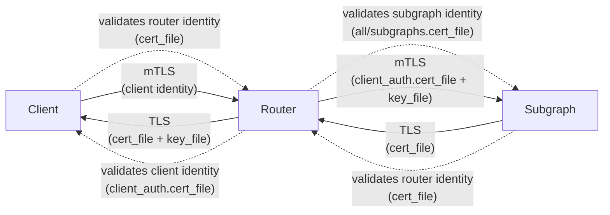

## 0.0.31 (2026-06-19)

### Fixes

#### Make the subscription subgraph executor buffer capacity configurable

When a subscription is established, the router reads events from the subgraph (over HTTP streaming or WebSocket) and runs each one through entity resolution before fanning it out to listeners. A per-subscription buffer sits between the subgraph and that processing pipeline so the subgraph is never throttled when the router falls behind. When the buffer is full, the newest incoming event is dropped (and logged) instead of slowing down or tearing down the connection to the subgraph.

The size of this buffer is now configurable via `subscriptions.subgraph_buffer_capacity`. A larger capacity gives the router more headroom to absorb bursts at the cost of memory and potentially staler events under sustained backpressure; a smaller capacity keeps memory minimal and drops eagerly. It defaults to `1024`, favoring high throughput.

```yaml
subscriptions:
  enabled: true
  subgraph_buffer_capacity: 1024 # default
```

## 0.0.30 (2026-06-18)

### Fixes

#### Mark failed subgraph HTTP requests as errors on their trace span

When an outgoing subgraph HTTP request failed at the transport level (connection error, timeout, body read failure, etc.), the `http.client` span was left with an unset `otel.status_code`, so the failure was not surfaced as an error in traces (e.g. Datadog). The error was only recorded in metrics. The span is now marked with `otel.status_code = "Error"` and the corresponding `error.type` on the failure path, matching the existing metrics behaviour.

## 0.0.29 (2026-06-17)

### Fixes

#### Add an experimental query planner option, `experimental_abstract_type_folding`

```yaml
query_planner:
    experimental_abstract_type_folding: true # false by default
```

Folds matching concrete object-type fragments in subgraph calls, into a shared interface fragment even when that interface is not the field's declared return type.

It's an opt-in addition to [`011be5b`](https://github.com/graphql-hive/router/commit/011be5bdbfb00bf1e415eb7a50e6be91f565ef05).

```diff
## queries `product-service` subgraph
query {
  products {
-    ... on Book  { id title }
-    ... on Movie { id title }
+    ... on Media { id title }
  }
}
```

The `products` field returns `Product` interface, but one object-type member of this interface called `Album` is not present in the query, therefore `... on Product {...}` is not possible to use (default behavior). With the feature flag enabled, both fragments are folded into `... on Media { ... }`, because `Book` and `Movie` are the only members of the `Media` interface in the `product-service` subgraph.

## 0.0.28 (2026-06-15)

### Features

#### Demand Control with `@cost` and `@listSize` directives

Add support for the [Demand Control specification](https://ibm.github.io/graphql-specs/cost-spec.html), allowing operators to limit the cost of incoming GraphQL operations using the `@cost` and `@listSize` directives.

The router now calculates the cost of incoming operations based on directive-driven type, field, and argument costs (with list-size estimation) and can reject operations that exceed a configured maximum. Both static (request) and actual (response) cost can be measured, and the behavior is configurable via the new `demand_control` section in the router configuration.

Telemetry is included: new metrics under `demand_control_metrics` and additional span attributes expose estimated/actual cost and rejection reasons for observability.

[Documentation for the feature is available here](https://the-guild.dev/graphql/hive/docs/router/security/demand-control)

### Fixes

#### Add at-least-once sampling for Usage Reporting

Hive Router now supports at-least-once sampling for Usage Reporting.

This feature is useful when you want to keep a low sampling rate, but still make sure all operations are visible in Hive at least once.

The first request for each unique key is always reported. Later requests for the same key follow the configured sampling `rate`.

Example configuration:

```yaml
telemetry:
  hive:
    usage_reporting:
      enabled: true
      sampling:
        rate: "10%" # 10% of operations will be reported
        at_least_once:
          key: # the combination of operation's name and body makes the request unique
            - operation_name
            - operation_body
          max_distinct_keys: 12000 # how many keys to track and hold in memory
```

Keys are tracked in memory, up to `max_distinct_keys` (default: `100_000`). Every key takes approximately 16 bytes of memory.

#### Apply usage-reporting excludes before sampling

Exclusion of Usage Reports is now evaluated before sampling. Excluded operations are dropped immediately and sampling is not affected.

#### Move `sample_rate` into `sampling.rate`

**Breaking change** The sampling configuration of Usage Reporting has been reorganized.

```diff
telemetry:
  hive:
    usage_reporting:
-      sample_rate: "10%"
+      sampling:
+        rate: "10%"
```


The old top-level `sample_rate` field has been replaced by `sampling.rate`.

## 0.0.27 (2026-06-13)

### Fixes

- Version bump and update `vrl` to latest

## 0.0.26 (2026-06-03)

### Fixes

#### Forward operation name to subgraphs

Added the `traffic_shaping.all.forward_operation_name` and `traffic_shaping.subgraphs.<name>.forward_operation_name` options. The option defaults to `false`.

The operation name is injected (opt-in) into the query document and the `operationName` JSON field, formatted as `<client_operation_name>__<fetch_step_id>`, when sending requests to subgraphs.

Global opt-in:

```yaml
traffic_shaping:
  all:
    forward_operation_name: true
```

Per-subgraph opt-in:

```yaml
traffic_shaping:
  subgraphs:
    products:
      # Overrides global setting for this subgraph
      forward_operation_name: true
```

#### Path parameters from `http.graphql_endpoint`

Any path parameters captured from the configured pattern are now exposed:

- in expressions as `.request.path_params`
- in plugins through the existing `RouterHttpRequest.match_info`

```yaml
http:
  graphql_endpoint: /{tenant}/graphql
override_subgraph_urls:
  all:
    url:
      expression: |
        tenant = string!(.request.path_params.tenant)
        replace(string!(.default), "/api/", "/api/" + tenant + "/")
```

A request to `/acme/graphql` resolves `tenant` to `"acme"` before the expression runs.

#### Improve parsing of Router configuration

Improve error messages when parsing Router configuration, in cases where `SingleOrMultiple<T>` is used and parsing of `T` fails. 

The error is now visible to the user, instead of being swallowed and reported as a generic error.

#### BREAKING: `override_subgraph_urls.subgraphs` and global `all`

In `override_subgraph_urls` the per-subgraph overrides now live under a `subgraphs` field, alongside a new optional `all` override.

```yaml
## Before
override_subgraph_urls:
  accounts:
    url: "https://accounts.example.com/graphql"
  products:
    url:
      expression: |
        if .request.headers."x-region" == "us-east" {
          "https://products-us-east.example.com/graphql"
        } else {
          .default
        }

## After
override_subgraph_urls:
  subgraphs:
    accounts:
      url: "https://accounts.example.com/graphql"
    products:
      url:
        expression: |
          if .request.headers."x-region" == "us-east" {
            "https://products-us-east.example.com/graphql"
          } else {
            .default
          }
  all:
    url:
      expression: |
        if .subgraph.name == "reviews" {
          "https://reviews.example.com/graphql"
        } else {
          .default
        }
```

A single override under `override_subgraph_urls.all.url` is now applied to every subgraph that does not have its own per-subgraph override. This is useful when the override logic is the same for all subgraphs or depends on the current subgraph name.

The expression has access to:

- `.request`: the incoming HTTP request
- `.default`: the original subgraph URL from the supergraph SDL
- `.subgraph.name`: the name of the subgraph the URL is being resolved for

Per-subgraph entries under `subgraphs.<name>` always take precedence over `all`.

## 0.0.25 (2026-05-27)

### Fixes

#### Add tracing sampling rate environment override

The tracing sampling rate can now be overridden without editing the router config file:

```shell
TELEMETRY_TRACING_SAMPLING_RATE=0.1
```

This sets the same value as the following YAML configuration:

```yaml
telemetry:
  tracing:
    collect:
      sampling: 0.1
```

## 0.0.24 (2026-05-26)

### Fixes

#### External storage support (e.g S3)

[documentation](http://the-guild.dev/graphql/hive/docs/router/configuration/storages)

This release introduces a new top-level `storages` configuration and the first storage backend, s3, so the router can load external artifacts from object storage.

With this change, both the `supergraph` source and `persisted_documents` manifest can be resolved from a configured storage by reference. It also adds optional polling support so the router can reload updated content from storage without restarting.

Start by configuring the storage in your router config:

```yaml
storages: 
  my-s3: # this is the storage id 
    type: s3
    bucket: my-bucket
    region: eu-west-1
    # .. additional S3 configurations 
```

Then, you can use the storage id in your `supergraph` source:

```yaml
supergraph:
  source: storage
  storage_id: my-s3
  location: supergraphs/current.graphql
  poll_interval: 30s
```

Or, you can use the storage id in your `persisted_documents` manifest:

```yaml
persisted_documents:
  enabled: true
  require_id: true
  storage:
    type: storage
    storage_id: my-s3
    location: persisted/manifest.json
    poll_interval: 30s
```

#### Remove dependency ntex from console-sdk

Other pkgs are released due to minor refactor and code relocation.

## 0.0.23 (2026-05-19)

### Fixes

#### Fix: pin `ntex` version to `3.7.2` to avoid regressions

This release pins `ntex` to `3.7.2` to avoid regressions, like the one reported in [#997](https://github.com/graphql-hive/router/issues/997). 

Users who builds their own router are impacted by this regression, due to the way Cargo handles unpinned dependencies.

## 0.0.22 (2026-05-17)

### Fixes

#### Implement Circuit Breaker for Subgraph Requests

This change introduces a circuit breaker mechanism for subgraph requests in the Hive Router. The circuit breaker will monitor the success and failure rates of requests to each subgraph and will prevent future requests if the failure rate exceeds a certain threshold. When the circuit breaker is opened, subsequent requests to that subgraph will fail immediately without attempting to send the request.

This implementation helps improve the resilience and stability of the Hive Router when dealing with unreliable subgraphs.

## 0.0.21 (2026-05-13)

### Fixes

#### Allow overriding number of HTTP server workers

Adds a new `http.workers` configuration option (and `ROUTER_HTTP_WORKERS` environment variable) to control the number of HTTP server worker threads.

By default, the router spawns one worker per physical CPU core. In containerized environments such as Kubernetes the number of physical cores reported by the OS is often higher than the CPU limit assigned to the container, which leads to oversubscribed worker threads. Set `http.workers` (or `ROUTER_HTTP_WORKERS`) to match the container's CPU limit to avoid this.

```yaml
http:
  workers: 4
```

#### Add `cors.preflight_response_headers` to attach headers to CORS preflight (OPTIONS) responses

Adds a new optional `preflight_response_headers` map to the `cors` configuration block, and to each entry under `cors.policies`. The map allows attaching arbitrary headers (e.g. `Cache-Control`, `Server-Timing`, custom `X-*` headers) to CORS preflight (OPTIONS) responses.

This is useful because the `headers` configuration block does not affect preflight responses (they are returned early by the CORS layer), so there was previously no way to control headers like `Cache-Control` for `OPTIONS` requests.

Example:

```yaml
cors:
  enabled: true
  allow_any_origin: true
  max_age: 86400
  preflight_response_headers:
    Cache-Control: "public, max-age=86400"
```

## 0.0.20 (2026-05-05)

### Features

#### Improve HTTP server request OTel tracing with client and peer network attributes.

The `http.server` span now includes:
- `client.address` and `client.port` from a configurable request header
- `network.peer.address` and `network.peer.port` from the address of the incoming connection

```yaml
telemetry:
  client_identification:
    # Default - use socket peer only
    ip_header: null
    
    # Header name - use the left-most valid IP from the header
    ip_header: x-forwarded-for
    
    # Trusted proxies - only trust the header when the socket peer is trusted
    ip_header:
      name: x-forwarded-for
      trusted_proxies:
        - 10.0.0.0/8
        - 192.168.0.0/16
```

In trusted proxies scenario, the Router scans the configured header from right to left, skips trusted proxy IP ranges, and records the first non-trusted IP as `client.address`.
If no valid client IP can be resolved, the Router falls back to the socket peer address.

#### Coprocessors

Introduces Coprocessors as language agnostic way to extend Hive Router.

**Supports coprocessor stages:**
- `router.request`
- `router.response`
- `graphql.request`
- `graphql.analysis`
- `graphql.response`

**Stage capabilities:**
- include selected request/response fields in stage payloads (headers, body, context, and optional SDL depending on stage config)
- mutate request body/headers/context for downstream pipeline execution
- short-circuit and return an immediate HTTP response from a stage

**Transport and endpoint support:**
- `http://` and `unix://` (unix socket domain) endpoints
- http/1, http/2 and h2c protocols

**Error handling:**
- coprocessor failures map to server-side failures (500)
- client-facing GraphQL errors are masked as Internal server error
- structured error codes are preserved in GraphQL extensions.code
- detailed coprocessor failure reasons remain in server logs/telemetry only

**Adds coprocessor metrics:**
- hive.router.coprocessor.requests_total
- hive.router.coprocessor.duration
- hive.router.coprocessor.errors_total

### Fixes

- Adjustments in operation's kind being Enum and not &'static str

#### Dynamic Exclusions

### Dynamic Exclusions in Hive Router

Hive Router now supports dynamic exclusions, allowing you to exclude specific requests from usage reporting based on custom logic. This feature is useful for scenarios where you want to skip telemetry for certain requests, such as health checks or specific endpoints.

The previous operation-name list format is still supported for backward compatibility.

#### Usage
```diff
- exclude: ['ExcludedOp']
+ exclude:
+   expression: '.request.operation.name == "ExcludedOp"'
```

Both of the following are valid and supported:

```yaml
## legacy format
exclude:
  - ExcludedOp

## dynamic expression format
exclude:
  expression: '.request.operation.name == "ExcludedOp"'
```

The details about expression context is documented in the [Hive Router documentation](https://the-guild.dev/graphql/hive/docs/router/configuration/expressions).

### Dynamic Exclusions in Apollo Router

As in Hive Router, Apollo Router used to support only operation name based exclusions. With the new dynamic exclusions feature, you can now specify custom logic to exclude requests from usage reporting.


## New `add_report_with_request` method in Hive Console SDK

In order to support exclusions based on request properties, a new method `add_report_with_request` has been added to the Hive Console SDK. This method allows you to include the request information in the report, which can then be used in the dynamic exclusion logic.

## 0.0.19 (2026-04-27)

### Fixes

#### HTTP/2 Cleartext (h2c) Support for Subgraph Connections

Adds support for HTTP/2 cleartext (h2c) connections between the router and subgraphs via the new `allow_only_http2` configuration flag. When enabled, the router uses HTTP/2 prior knowledge to communicate with subgraphs over plain HTTP without TLS.

This is useful in environments where subgraphs support HTTP/2 but TLS is not required, such as service meshes, internal networks, or sidecar proxies.

### Configuration

The flag can be set globally for all subgraphs or per-subgraph. Per-subgraph settings override the global default.

#### Global (all subgraphs)

```yaml
traffic_shaping:
  all:
    allow_only_http2: true
```

#### Per-subgraph

```yaml
traffic_shaping:
  subgraphs:
    accounts:
      allow_only_http2: true
```

The default value is `false`, preserving the existing behavior of using HTTP/1.1 for plain HTTP connections and negotiating HTTP/2 via ALPN for TLS connections.

## 0.0.18 (2026-04-20)

### Features

#### Persisted Documents

Introduces persisted documents support in Hive Router with configurable extraction and storage backends.

Supports extracting persisted document IDs from:
- `documentId` in request body (default)
- `documentId` in URL query params (default)
- Apollo-style `extensions.persistedQuery.sha256Hash` (default)
- custom `json_path` (for example `doc_id` or `extensions.anything.id`)
- custom `url_query_param` (for example `?doc_id=123`)
- custom `url_path_param` (for example `/graphql/:id`)

Order is configurable and evaluated top-to-bottom.

Supports persisted document resolution from:
- file manifests (Apollo and Relay KV styles)
- Hive CDN (via `hive-console-sdk`)

File storage includes watch mode by default (with 150ms debounce) to reload manifests after file changes.
Hive storage validates document ID syntax before generating CDN paths to avoid silent invalid-path behavior.

Adds persisted-documents metrics:

- `hive.router.persisted_documents.extract.missing_id_total`
- `hive.router.persisted_documents.storage.failures_total`

These help track migration progress and resolution failures in production

### Fixes

#### TLS Support

Adds TLS support to Hive Router for both client and subgraph connections, including mutual TLS (mTLS) authentication. This allows secure communication between clients, the router, and subgraphs by encrypting data in transit and optionally verifying identities.

#### TLS Directions

TLS Support has implementations for the following 4 directions:

##### Router -> Client - Regular TLS
Router has an `identity` (`cert`, `key`), and client has `cert`, then Client validates the router's `identity`

##### Client -> Router - mTLS
Router has the `cert`, client has the `identity`, mTLS/Client Auth then the router validates the client's `identity`

##### Subgraph -> Router - Regular TLS
Subgraph has the `identity` (`cert`, `key`), and router has `cert`, then Router validates the subgraph's `identity`.

##### Router -> Subgraph - mTLS
Subgraph has the `cert`, router(which is the client this time) has the `identity`, then subgraph validates the router's `identity`.

#### TLS Directions Diagram



#### Configuration Structure
```yaml
traffic_shaping:
  router:
    key_file:          # Router server private key
    cert_file:         # Router server certificate(s)
    client_auth:       # mTLS: Client -> Router
       cert_file:      # Trusted client CA certificate(s)
  all:                 # Default TLS for all subgraph connections
    cert_file:         # Trusted subgraph CA certificate(s)
    client_auth:       # mTLS: Router -> Subgraph
       cert_file:      # Router client certificate(s)
       key_file:       # Router client private key
  subgraphs:
    SUBGRAPH_NAME:     # Per-subgraph TLS override
      cert_file:       # Trusted subgraph CA certificate(s)
      client_auth:     # mTLS: Router -> Subgraph
         cert_file:    # Router client certificate(s)
         key_file:     # Router client private key
```

## 0.0.17 (2026-04-15)

### Fixes

#### Federated GraphQL Subscriptions

Hive Router now supports federated GraphQL subscriptions with full protocol coverage across [SSE](https://the-guild.dev/graphql/hive/docs/router/subscriptions/sse), [WebSockets](https://the-guild.dev/graphql/hive/docs/router/subscriptions/websockets), [Multipart HTTP](https://the-guild.dev/graphql/hive/docs/router/subscriptions/multipart-http), [Incremental Delivery](https://the-guild.dev/graphql/hive/docs/router/subscriptions/incremental-delivery), and [HTTP Callback](https://the-guild.dev/graphql/hive/docs/router/subscriptions/http-callback) - for both client-to-router and router-to-subgraph communication. Subscription events spanning multiple subgraphs are resolved automatically: when a subscription field lives in one subgraph but the response includes entity fields owned by others, the router fetches those on every event with no extra configuration.

- [Read the product update](https://the-guild.dev/graphql/hive/product-updates/2026-04-14-hive-router-subscriptions)
- [Subscriptions overview](https://the-guild.dev/graphql/hive/docs/router/subscriptions)
- [Server-Sent Events](https://the-guild.dev/graphql/hive/docs/router/subscriptions/sse)
- [Incremental Delivery over HTTP](https://the-guild.dev/graphql/hive/docs/router/subscriptions/incremental-delivery)
- [Multipart HTTP](https://the-guild.dev/graphql/hive/docs/router/subscriptions/multipart-http)
- [WebSockets](https://the-guild.dev/graphql/hive/docs/router/subscriptions/websockets)
- [HTTP Callback](https://the-guild.dev/graphql/hive/docs/router/subscriptions/http-callback)

## 0.0.16 (2026-04-13)

### Fixes

- Version bump to fix release issues

## 0.0.15 (2026-03-26)

### Features

#### Add router-level in-flight request deduplication for GraphQL queries

The router now supports deduplicating identical incoming GraphQL query requests while they are in flight, so concurrent duplicates can share one execution result.

### Configuration

A new router traffic-shaping section is available:

- `traffic_shaping.router.dedupe.enabled` (default: `false`)
- `traffic_shaping.router.dedupe.headers` as `all`, `none`, or `{ include: [...] }` (default: `all`)

Supported header config shapes:

```yaml
headers: all
```

```yaml
headers: none
```

```yaml
headers:
  include:
    - authorization
    - cookie
```

Header names are validated and normalized as standard HTTP header names.

### Deduplication key behavior

The router dedupe fingerprint includes:

- request method and path
- selected request headers (based on dedupe header policy)
- normalized operation hash
- GraphQL variables hash
- schema checksum
- GraphQL extensions

## 0.0.14 (2026-03-12)

### Features

#### Metrics with OpenTelemetry and Prometheus

This release adds support for OpenTelemetry metrics. In addition to existing tracing support, the router can now collect detailed metrics about HTTP and GraphQL activity and export them to a Prometheus endpoint or to an OTLP collector.

- Telemetry configuration now has a `metrics` section. Users can enable metrics exporters and tune histogram buckets under `telemetry.metrics` in `router.config.yaml`. By default metrics are disabled, so existing configurations continue to work unchanged.
- **Prometheus exporter** exposes a `/metrics` endpoint that follows the standard Prometheus text format. It can be attached to Router's http server or run on its own port. 
- **OTLP exporter** is available for sending metrics to an OpenTelemetry collector via gRPC or HTTP.
- **Instrumentation for every stage of the pipeline** - parsing, normalization, validation, planning and execution.
- **HTTP client/server metrics** - Router records metrics for incoming HTTP requests (latencies, sizes and status codes) and for outbound subgraph requests. These instruments follow the OpenTelemetry HTTP semantic conventions, making them usable out‑of‑the‑box with observability backends.
- **Supergraph reload metrics** - polling and reloading the supergraph is measured with poll counts, durations and errors, giving visibility into slow or failed schema reloads.

**Example configuration**

```yaml
telemetry:
  metrics:
    exporters:
      - prometheus:
          enabled: true
          # optional custom path (default `/metrics`)
          path: /metrics
          # serve on this port
          port: 9090
      - otlp:
          enabled: true
          # An absolute path to the OpenTelemetry collector
          endpoint: "http://otel-collector:4317"
          # protocol can be `grpc` or `http`
          protocol: http
    instrumentation:
      instruments:
        # Disable HTTP server request duration metric
        http.server.request.duration: false
        http.client.request.duration:
          attributes:
            # Disable the label
            graphql.operation.name: false
```

Visit ["OpenTelemetry Metrics" documentation](https://the-guild.dev/graphql/hive/docs/router/observability/metrics) for more details on configuring metrics and exporters.

## 0.0.13 (2026-03-05)

### Features

#### Plugin System

This release introduces a Plugin System that allows users to extend the functionality of Hive Router by creating custom plugins.

```rust
use hive_router::plugins::plugin_trait::RouterPlugin;
use hive_router::async_trait;
 
struct MyPlugin;
 
##[async_trait]
impl RouterPlugin for MyPlugin {
    type Config = ();
 
    fn plugin_name() -> &'static str {
        "my_plugin"
    }
}
```

You can learn more about the plugin system in the [technical documentation](https://the-guild.dev/graphql/hive/docs/router/plugin-system) and in [Extending the Router guide](https://the-guild.dev/graphql/hive/docs/router/guides/extending-the-router).

This new feature also exposes many of the Router's internals through the [`hive-router` crate](https://crates.io/crates/hive-router).

### Fixes

#### Adds `noop_otlp_exporter` feature for internal usage

Hive Router uses `noop_otlp_exporter` internally for testing purposes. This change adds the `noop_otlp_exporter` feature to the `hive-router` crate so that it can be used internally while testing the router.

#### Dependencies Updates

- Update `rustls`, `aws-lc-rs` and `aws-lc-sys` dependencies to address `PKCS7` CVE in `aws-lc` crates.
- Update `rand` to latest version.

## 0.0.12 (2026-02-12)

### Fixes

- Make `hive.inflight.key` span attribute unique per inflight group, for better identification of the leader and joiners in a distributed system.

## 0.0.11 (2026-02-11)

### Features

#### Move `telemetry.hive.endpoint` to `telemetry.hive.tracing.endpoint`.

The endpoint is tracing-specific, but its current placement at `telemetry.hive.endpoint` suggests it applies globally to all Hive telemetry features. This becomes misleading now that usage reporting also defines its own endpoint configuration (`telemetry.hive.usage_reporting.endpoint`).

```diff
telemetry:
  hive:
-   endpoint: "<value>"
+   tracing:
+     endpoint: "<value>"
```

## 0.0.10 (2026-02-10)

### Fixes

#### Hive telemetry (tracing and usage reporting) is now explicitly opt-in.

Two new environment variables are available to control telemetry:
  - `HIVE_TRACING_ENABLED` controls `telemetry.hive.tracing.enabled` config value
  - `HIVE_USAGE_REPORTING_ENABLED` controls `telemetry.hive.usage_reporting.enabled` config value
  
The accepted values are `true` or `false`.

If you only set `HIVE_ACCESS_TOKEN` and `HIVE_TARGET`, usage reporting stays disabled until explicitly enabled with environment variables or configuration file.

#### Tracing with OpenTelemetry

Introducing comprehensive OpenTelemetry-based tracing to the Hive Router, providing deep visibility into the GraphQL request lifecycle and subgraph communications.

- **OpenTelemetry Integration**: Support for OTLP exporters (gRPC and HTTP) and standard propagation formats (Trace Context, Baggage, Jaeger, B3/Zipkin).
- **GraphQL-Specific Spans**: Detailed spans for every phase of the GraphQL lifecycle
- **Hive Console Tracing**: Native integration with Hive Console for trace visualization and analysis.
- **Semantic Conventions**: Support for both stable and deprecated OpenTelemetry HTTP semantic conventions to ensure compatibility with a wide range of observability tools.
- **Optimized Performance**: Tracing is designed with a "pay only for what you use" approach. Overhead is near-zero when disabled, and allocations/computations are minimized when enabled.
- **Rich Configuration**: New configuration options for telemetry exporters, batching, and resource attributes.

#### Unified Hive Telemetry Configuration

Refactored the configuration structure to unify Hive-specific telemetry (tracing and usage reporting) and centralize client identification.

- **Unified Hive Config**: Moved `usage_reporting` under `telemetry.hive.usage_reporting`. Usage reporting now shares the `token` and `target` configuration with Hive tracing, eliminating redundant settings.
- **Centralized Client Identification**: Introduced `telemetry.client_identification` to define client name and version headers once. These are now propagated to both OpenTelemetry spans and Hive usage reports.
- **Enhanced Expression Support**: Both Hive token and target ID now support VRL expressions for usage reporting, matching the existing behavior of tracing.

#### Breaking Changes:

The top-level `usage_reporting` block has been moved. 

**Before:**
```yaml
usage_reporting:
  enabled: true
  access_token: "..."
  target_id: "..."
  client_name_header: "..."
  client_version_header: "..."
```

**After:**
```yaml
telemetry:
  client_identification:
    name_header: "..."
    version_header: "..."
  hive:
    token: "..."
    target: "..."
    usage_reporting:
      enabled: true
```

## 0.0.9 (2026-02-06)

### Features

- Operation Complexity - Limit Aliases (#746)
- Operation Complexity - Limit Aliases (#749)

## 0.0.8 (2026-01-27)

### Fixes

- Bump version to fix release and dependencies issues

## 0.0.7 (2026-01-22)

### Fixes

#### New Query Complexity Configuration in `hive-router` and `hive-router-config`

We have introduced a new configuration module for query complexity in the Hive Router. 

This includes new validation rules to enforce maximum query depth, maximum number of directives in the incoming GraphQL operation, helping to prevent overly complex queries that could impact performance.

### Max Depth

By default, it is disabled, but you can enable and configure it in your router configuration as follows:

```yaml
limits:
  max_depth:
    n: 10  # Set the maximum allowed depth for queries
```

This configuration allows you to set a maximum depth for incoming GraphQL queries, enhancing the robustness of your API by mitigating the risk of deep-nested queries.

### Max Directives

You can also limit the number of directives in incoming GraphQL operations. This is also disabled by default. You can enable and configure it as follows:

```yaml
limits:
  max_directives:
    n: 5  # Set the maximum allowed number of directives
```

This configuration helps to prevent excessive use of directives in queries, which can lead to performance issues.

### Max Tokens

Additionally, we have introduced a new configuration option to limit the maximum number of tokens in incoming GraphQL operations. This feature is designed to prevent excessively large queries that could impact server performance.

By default, this limit is disabled. You can enable and configure it in your router configuration as follows:

```yaml
limits:
  max_tokens:
    n: 1000  # Set the maximum allowed number of tokens
```

This configuration allows you to set a maximum token count for incoming GraphQL queries, helping to ensure that queries remain manageable and do not overwhelm the server.

With these new configurations, you can better manage the complexity of incoming GraphQL queries and ensure the stability and performance of your API.

## 0.0.6 (2026-01-14)

### Fixes

#### Improved Performance for Expressions

This change introduces "lazy evaluation" for contextual information used in expressions (like dynamic timeouts).

Previously, the Router would prepare and clone data (such as request details or subgraph names) every time it performed an operation, even if that data wasn't actually needed.
Now, this work is only performed "on-demand" - for example, only if an expression is actually being executed.
This reduces unnecessary CPU usage and memory allocations during the hot path of request execution.

## 0.0.5 (2026-01-12)

### Fixes

#### Bump hive-router-config version

Somehow the `hive-router-internal` crate was published with an older version of the `hive-router-config` dependency.

## 0.0.4 (2025-12-12)

### Features

#### Support environment variables in expressions

We have added support for using environment variables in expressions within the Hive Router configuration.

Example usage:
```
headers:
  all:
    response:
      - insert:
          name: "x-powered-by"
          expression: env("SERVICE_NAME", "default-value")
```

### Fixes

- Bump `vrl` dependency to `0.29.0`

## 0.0.3 (2025-12-11)

### Fixes

- chore: Enable publishing of internal crate

## 0.0.2 (2025-12-11)

### Fixes

#### Extract expressions to hive-router-internal crate

The `expressions` module has been extracted from `hive-router-executor` into the `hive-router-internal` crate. This refactoring centralizes expressions handling, making it available to other parts of the project without depending on the executor.

It re-exports the `vrl` crate, ensuring that all consumer crates use the same version and types of VRL.
